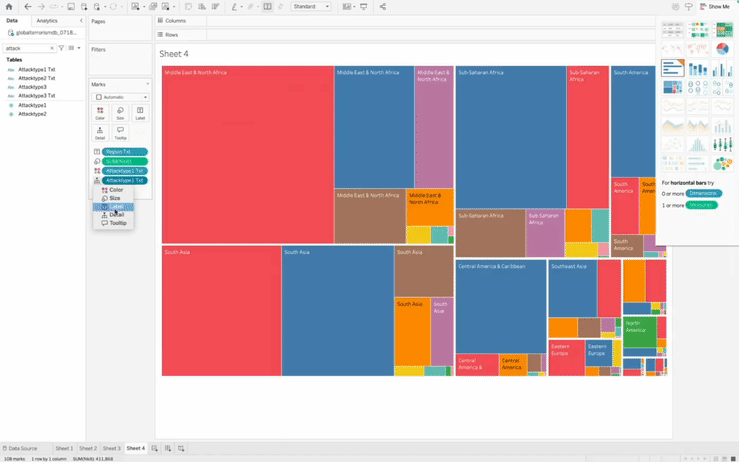

# 📊 Project Title: **Global Terrorism Analysis: Big Data Insights using PySpark and Tableau**




## Overview

This project investigates global terrorism trends using comprehensive big data analytics and interactive visualization tools. Utilizing the Global Terrorism Database (GTD)—the most extensive open-source collection of global terrorist incident data—this analysis identifies patterns, geographic hotspots, and strategic insights, aiding policymakers, analysts, and researchers in counterterrorism efforts.

---

## 📁 Project Structure

```
Big_Data_Analysis_Visualization-Global_Terrorism_Dataset-7153CEM/
│
├── Big_Data_Analysis_and_Data_Visualization.ipynb  # Jupyter Notebook for PySpark analysis and visualization
├── globalterrorismdb_0718dist.csv                  # Raw Global Terrorism Dataset
├── choropleth_attacks_by_country.html              # Interactive choropleth map showing attacks by country
├── choropleth_fatalities_by_country.html           # Interactive choropleth map showing fatalities by country
├── global_terrorism_clusters.html                  # HTML visualization of terrorism clusters
├── heatmap_attacks.html                            # Interactive heatmap visualization of terrorist attacks
├── map_by_target_type.html                         # Interactive map categorized by attack target types
├── terrorism_clusters_map.html                     # Interactive map visualizing clusters of terrorist activity
├── terrorism_map.html                              # Interactive global map visualizing terrorist attacks
├── Visualizations.twbx                             # Tableau dashboard file
├── README.md                                       # Project overview and setup instructions
└── requirements.txt                                # Python dependencies required for the project
```

---

## 📑 Dataset Metadata

**Context:**

* Data on over 180,000 terrorist attacks globally.
* Maintained by the National Consortium for the Study of Terrorism and Responses to Terrorism (START) .

**Content:**

* **Geography:** Worldwide
* **Time Period:** 1970–2017 (excluding 1993)
* **Unit of Analysis:** Individual terrorist attacks
* **Variables:** Over 100 detailed variables, including location, attack type, perpetrators, targets, and outcomes
* **Data Sources:** Primarily unclassified media reports, maintained by START as [GTD](https://www.start.umd.edu/data-tools/GTD). The open-sourced version of the GTD can also be downloaded from [Kaggle](https://www.kaggle.com/datasets/START-UMD/gtd). 

---

## 🔧 Setup and Installation Instructions


**⚠️ Note:** These steps must be executed on the server to ensure proper setup and functionality.

### Step 1: Connect to the Server

Use the following command to connect to the server:

```bash
ssh -i /path/to/private_key username@your.azure.server.ip
```

Once connected, proceed with the setup steps below.

### Optional: Simplified Setup with `run.sh`

You can skip Steps 2, 3, and 4 by using the provided `run.sh` script.

#### Step 1: Grant Execution Permission

Before running the script, provide execution privileges:

```bash
chmod +x run.sh
```

#### Step 2: Execute the Script

Run the script to automatically set up the environment and install dependencies:

```bash
./run.sh
```

This will streamline the setup process and prepare the project for use.

### Step 2: Setup Virtual Environment

Create and activate a virtual environment:

```bash
python -m venv .venv
source .venv/bin/activate   # Windows: .venv\Scripts\activate
```

### Step 3: Install Dependencies

Install necessary Python packages:

```bash
pip install -r requirements.txt
```

### Step 4: Launch Jupyter Notebook on Azure

Run Jupyter Notebook remotely on Azure cloud:

```bash
jupyter notebook --no-browser --ip=0.0.0.0 --port=8888
```

### Step 5: Access Jupyter Notebook from Local Machine

After running the above command, you will see a token in your terminal output:

```plaintext
http://127.0.0.1:8888/?token=your_generated_token_here
```

**Copy this token for authentication.**

Then, establish SSH port forwarding from your local machine using:

```bash
ssh -i /path/to/private_key -L 8888:localhost:8888 username@your.azure.server.ip
```
**💡 Note:** If you encounter an error indicating that port `8888` is not open, replace `8888` with another value between `8880-8898` in both the `jupyter notebook` command and the SSH port forwarding command.

Open your local browser and navigate to:

```plaintext
http://127.0.0.1:8888
```
Enter the copied token to authenticate and access Jupyter Notebook.

OR

```plaintext 
 http://127.0.0.1:8888/?token=your_generated_token_here
 ```

Open `Big_Data_Analysis_and_Data_Visualization.ipynb` to start analyzing the dataset and run the cells.

### Step 6: Tableau Installation and Usage

* **Download Tableau Public:**

Visit [Tableau Public Download](https://public.tableau.com/en-us/s/download) and download Tableau Public.

* **Setup:**

  * Install Tableau Public on your local machine.
  * Open Tableau Public.
  * Load the provided `Visualizations.twbx` file from the downloaded project.

---

## 📈 Step-by-Step Guide

### Step 1:

Run `Big_Data_Analysis_and_Data_Visualization.ipynb` within Jupyter Notebook for detailed data analysis and generating visualizations.

### Step 2:

View the interactive `.html` files directly in your local browser for further insights.

### Step 3:

Open `Visualizations.twbx` in Tableau Public to explore interactive dashboards providing comprehensive insights into terrorism trends.

---

## 📊 Results

* **Interactive HTML Visualizations** provide geographic, temporal, and categorical insights.
* **Tableau Dashboard** enables in-depth analytical exploration of terrorism data.
* Interpret analytical insights detailed in visualizations and Tableau dashboard for comprehensive strategic understanding.
